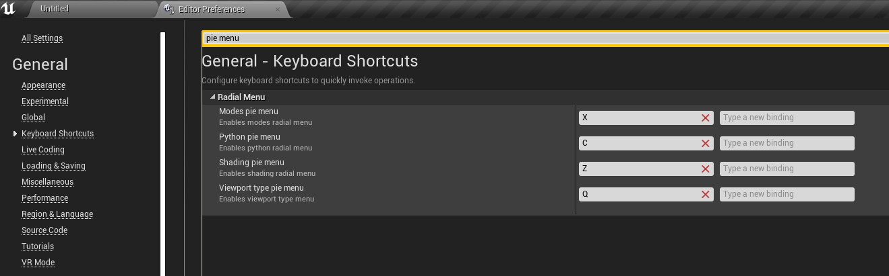
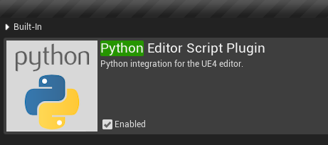
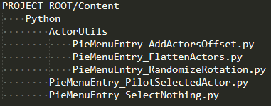

# UE4 pie menu plugin documentation

This plugin adds blender-like radial menus to Unreal Engine 4 editor.

> Unlike blender, menus can be nested, like maya's markin menus.

> Menu entries are evenly distributed in a circle.

For now there are 4 menus that can be invoked inside level editor viewport:
  * Modes menu
    
  * Python menu
    
  * Shading menu
    
  * Viewport type menu
    

To summon particular menu, hit corresponding keyboard shortcut.

While buttons are pressed, move mouse pointer aside.

## How to setup python menu
Python menu is special one!

1) First of all, what you obviously want to do - is to enable PythonScriptPlugin.

2) Second - create python scripts to be added to menu. When command is activated, plugin will search `PieMenuEntry_` prefixed python scripts e.g. ("PieMenuEntry_MyUtil.py")
under following directories:
    * ProjectRoot/Content/Python
    * Plugin/Content/Python

For example, this file structure:

becomes a radial menu with single nested entry (*see first gif on this page*)
